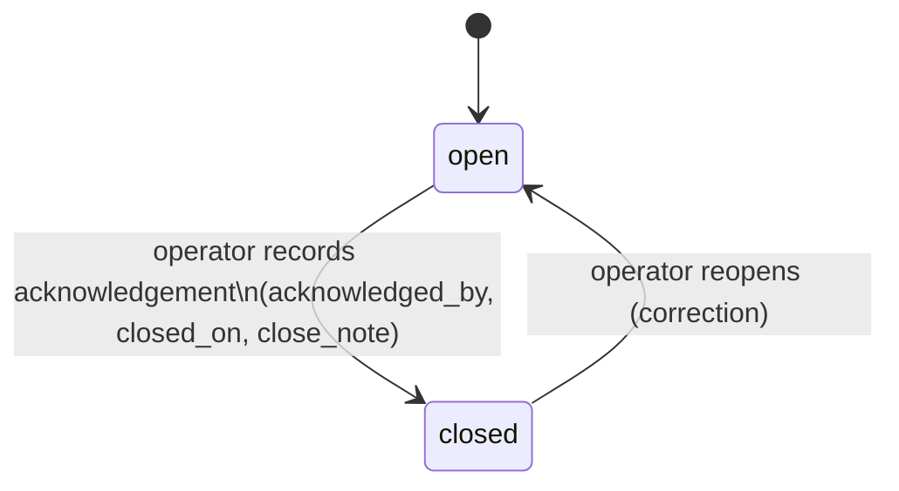
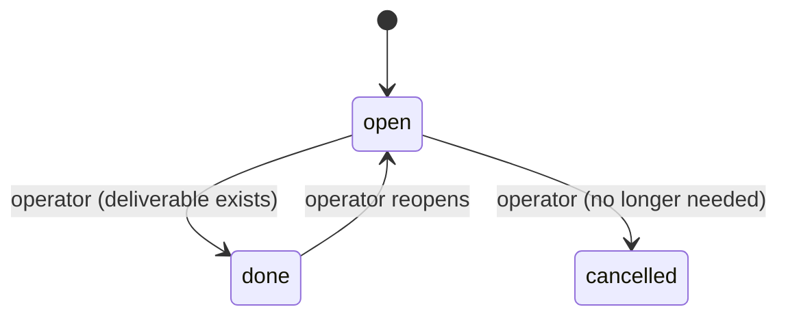
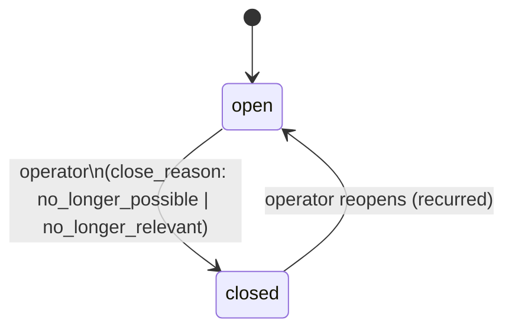
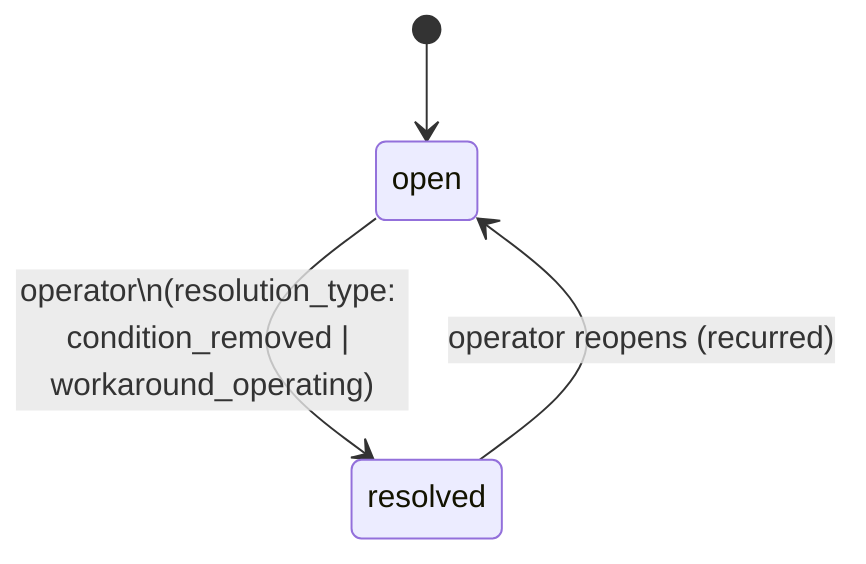
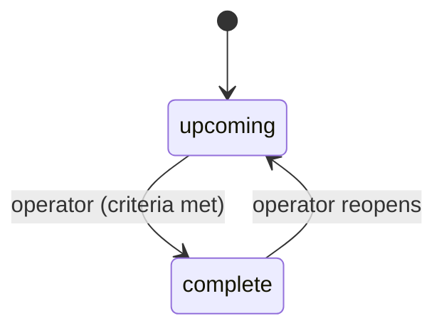
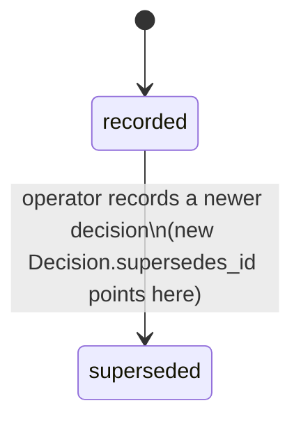
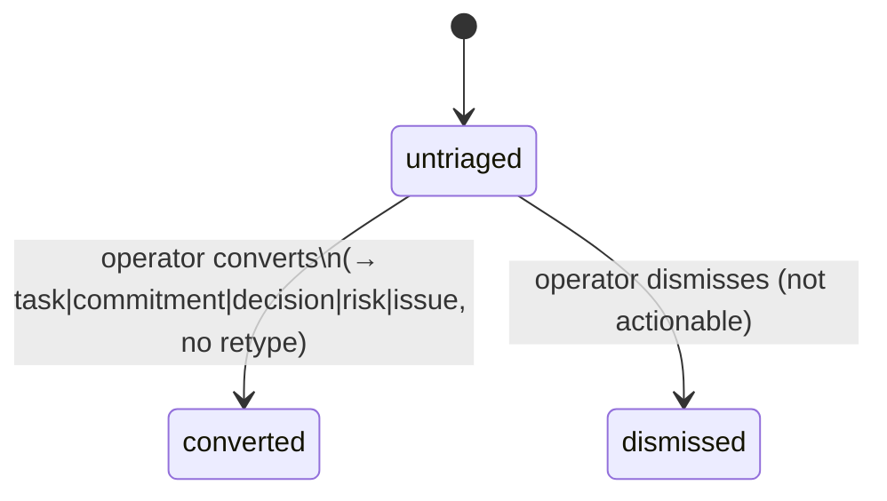
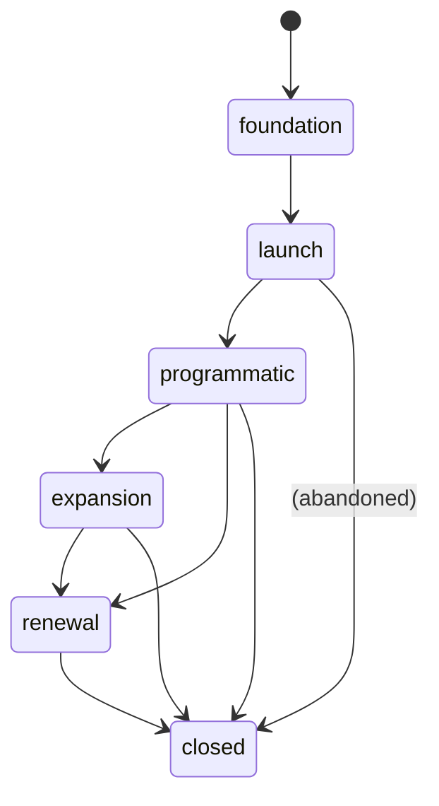
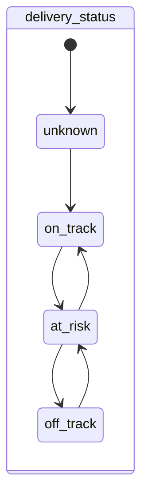
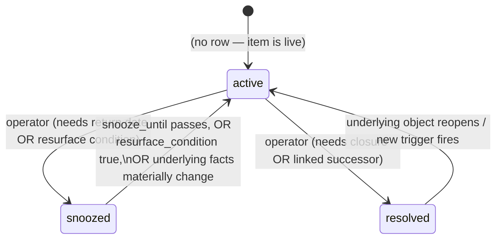

# State transitions — v0

Valid statuses for each stateful object, the closure rules from the Section 4 "definitions of done" paragraph, and who/what can trigger each move. In v0 the only human trigger is the operator (single editor); "system" means a derived/automatic effect.

Closure always records **date, closer, and a short note** (Section 4). Nothing is hard-deleted — `archive` is available from every state (soft-delete, CLAUDE.md) and is not drawn on every diagram.

---

## Commitment

Closes when **the receiving party acknowledges completion** — not when work merely looks done.

- `open → closed`: operator, and only after the receiving party acknowledges. Requires `acknowledged_by_id`, `closed_on`, `close_note`.
- `overdue` is **not** a status — it is derived (`open AND due_date < today`) and drives the queue.
- Reopen allowed for correction; logged in audit.

## Task

Complete when **its deliverable exists**.

- `open → done`: operator; requires `closed_on`, `close_note`.
- `open → cancelled`: operator; requires `close_note` (why dropped).

## Risk

Closes when the risk is **no longer possible or relevant — not when mitigation begins**.

- Adding `mitigation` text does **not** change status — explicit guard, since conflating the two is the named failure mode.
- `open → closed`: requires `close_reason`, `closed_on`, `close_note`.

## Issue

Resolves when the **condition is removed or an accepted workaround is operating**.

- `open → resolved`: requires `resolution_type`, `resolved_on`, `resolution_note`.

## Milestone

Completes when its **success criteria are met**.

- `at_risk` is a flag on `upcoming`, not a separate state. Set manually by operator, or surfaced by the queue when `upcoming AND target_date < today`.
- `upcoming → complete`: requires `completed_on`, `completion_note`.

## Decision

A decision is a **logged fact**, not an open/close lifecycle. It can only be superseded.

- `recorded → superseded`: set automatically when a new Decision cites this one via `supersedes_id`. The old decision is retained, never edited away.

## CaptureInboxItem

- `untriaged` items remain in the attention queue until they leave this state.
- `converted`: records `converted_to_type`, `converted_to_id`, `resolved_on`, `resolved_by`.
- `dismissed`: records `resolved_on`, `resolved_by` (dismissal is auditable, not silent).

## Program (phase)

Phase is operator-judged; there is **no automatic phase advance in v0** (phase gates that would gate this are v1).

- All phase moves: operator only. Phases are not strictly linear — an account can skip (e.g. Programmatic → Renewal) or close early. Backward moves are allowed but audit-logged (unusual, worth a trail).
- `→ closed`: on program close, capture lessons learned, open commitments at handoff, successor brief (Section 4 lifecycle) — these are notes in v0, not new objects.

## Account (two statuses)

Two independent hand-judged statuses; **no composite** (Section 11). Each value carries rationale, `assessed_on`, and change condition.

(Commercial status has the identical shape and is fully independent — the whole point is that excellent delivery can coexist with weak commercial, or vice versa.)

- Any move: operator only. Requires updating `*_rationale`, `*_assessed_on`, `*_change_condition`.
- **Freshness rule (Section 1.7):** the interface warns when `assessed_on` is older than the 30-day reassessment interval. This is a UI warning, not an automatic status change — a manual status is *not* auto-set to unknown (only *metric-derived* indicators do that, and there are none in v0).

## AttentionState (queue overlay)

See `attention-rules.md` for what "materially change" means per trigger.
